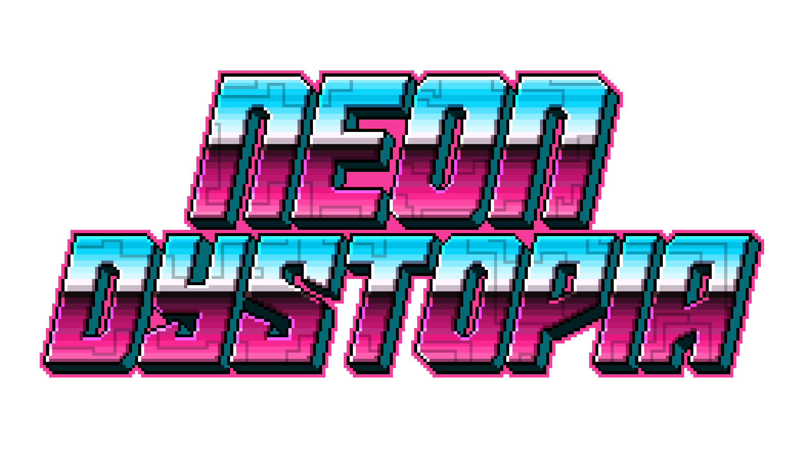

# Neon Dystopia
### Be careful, this project is still in development.

## What is Neon Dystopia ?
Neon Dystopia is a labyrinth and puzzle video game in a Retrowave style. The aim is to escape from each maze floor by activating mechanisms.

## How to install ?
1. Install [**IntelliJ IDEA**](https://www.jetbrains.com/idea/)
2. Clone the project with the following command:
```shell
git clone https://github.com/guillaume-rce/Neon-Dystopia.git
```
3. Open the project with IntelliJ IDEA
4. Install the JDK 20 recommended by IntelliJ IDEA
5. Run the project

## License
This project is under the GNU GPL v3 with Non-Commercial Clause (NC) license. For more information, see the [LICENSE.md](LICENSE.md) file.
